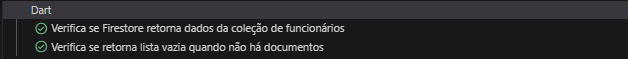
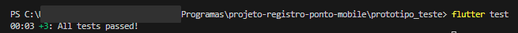

# Documento de testes unitários para o aplicativo GeoPonto
- ### Os testes estão localizados no diretório `test`
    - ### Teste conexão com Firebase:
    

    - ### Teste com Geolocator:
    
- ## Utilizando o comando `flutter test`:
 

